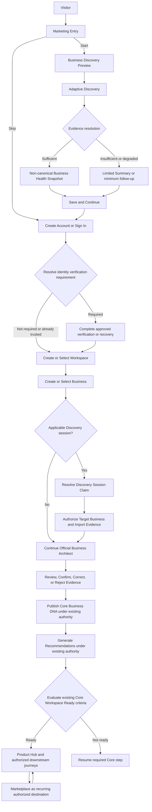
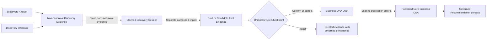
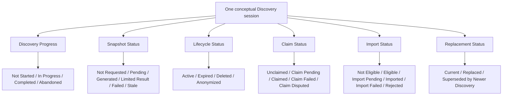

# Business Discovery Preview Proposal

| Metadata | Value |
|---|---|
| Version | v0.1 |
| Status | **Proposed for Authority Review** |
| Date | 2026-07-22 |
| Owner | Nexoraxs Architecture Governance |
| Artifact type | Non-authoritative governance proposal |
| Product identity | Nexoraxs Business Operating Intelligence Platform |
| Related ADR | [ADR-042: Pre-registration Business Discovery](../../ADR/ADR-042-pre-registration-business-discovery.md) — Proposed |
| Authority crosswalk | [Authority and Impact Crosswalk](./01-AUTHORITY-AND-IMPACT-CROSSWALK.md) |
| Open questions | [Open Questions Register](./02-OPEN-QUESTIONS-REGISTER.md) |

> **Authority notice:** This document is a proposal for human review. It is not an
> approved Customer Journey, does not amend Genesis or a Freeze, and does not authorize
> implementation. Existing frozen and accepted authority controls wherever this proposal
> conflicts with it.

## 1. Executive Summary

This proposal introduces **Business Discovery Preview** as optional, pre-registration value
demonstration terminology. The proposed experience would gather non-canonical evidence and,
when evidence is sufficient, present a non-canonical **Business Health Snapshot** or clearly
labeled provisional guidance. It would demonstrate that Nexoraxs can begin to understand a
business before asking the visitor to register.

The proposed experience would not create a Workspace, Business, Workspace Membership, Business
DNA, canonical Recommendation, Workspace Entitlement, OS Subscription, installation,
activation, `Core Workspace Ready`, or `Operating System Ready` state. Anonymous Discovery is
not a Business Architect Session. If an authenticated User later proves control of the anonymous
Discovery session, that claim would concern the session only. A separate authorization decision
for a selected formal Business would be required before eligible evidence could be imported into
the governed Business Architect Pipeline as draft or Candidate Fact evidence. Import would retain
provenance and could not bypass review or publication requirements.

This proposed branch conflicts with the frozen account-first Customer Journey and therefore
requires Architecture Review, explicit approval, an Accepted ADR, authorized authority updates,
and a successor or updated Freeze before it can become architecture. The precedence
inconsistency identified in the Stage A Authority Review also requires Governance disposition.

## 2. Problem Statement

The existing Customer Journey places Sign Up / Login before Workspace creation, Business
creation, and Business Architect. That sequence protects formal ownership and Business-scoped
Business DNA, but it does not define a governed way to demonstrate business understanding before
registration.

The product opportunity is to provide measurable pre-registration value without converting an
anonymous interaction into canonical business truth, a Recommendation, a permission grant, or a
commercial/readiness state. The architecture problem is not merely an extra marketing page. It
touches authority precedence, the frozen Customer Journey, identity, anonymous data lifecycle,
authorization, Business Architect evidence import, provenance, terminology, Business Brain and
Recommendation semantics, Product Hub composition, and privacy/security policy that remains
partly deferred.

## 3. Existing Authoritative Baseline

This proposal inherits the following baseline and does not change it while Proposed:

- The [Core Platform Freeze](../../../99-architecture-freeze/CORE-PLATFORM-v1.0-FREEZE.md)
  contains the controlling frozen baseline, including the existing Customer Journey and Accepted
  ADRs.
- The [NexoraXS Constitution](../../../../.specify/memory/constitution.md) states a freeze-first
  authority order. The [Architectural Milestone Lifecycle](../../MILESTONE-LIFECYCLE.md),
  [ADR governance](../../ADR/README.md), and the Core Platform Freeze also say Genesis remains
  ultimate authority. This inconsistency is unresolved and is recorded as BDP-C01 and OQ-GOV-001.
- The [Genesis Customer Journey](../../../01-genesis/11-CUSTOMER-JOURNEY.md) currently defines
  an account-first progression: Marketing Website, Sign Up / Login, Workspace, Business,
  Business Architect, Core Business DNA, Recommendations, Product Hub, OS setup, operation, and
  growth/Marketplace.
- A Workspace is the customer and tenant boundary and may contain multiple Businesses. Business
  DNA belongs to exactly one Business, never a Workspace or anonymous session. See
  [ADR-003](../../ADR/ADR-003-workspace-customer-multi-business-boundary.md),
  [ADR-004](../../ADR/ADR-004-genesis-organization-hierarchy.md), and
  [ADR-005](../../ADR/ADR-005-business-dna-business-scoped-software-independent.md).
- The official Business Architect is a resumable governed pipeline for one Workspace, one
  Business, and one initiating actor. Raw inputs, Candidate Facts, inferred facts, reviewed
  facts, and published facts remain distinct. See
  [ADR-016](../../ADR/ADR-016-business-architect-governed-pipeline.md), the
  [Core Platform Architecture](../../../02-core-platform/02-CORE-PLATFORM-ARCHITECTURE.md), and
  [Domain Model](../../../02-core-platform/03-DOMAIN-MODEL.md).
- Recommendations are capability-first, explainable, optional, reviewed, and governed. Product
  or plan options follow capability and business understanding; they do not create fit evidence.
  See [ADR-013](../../ADR/ADR-013-capability-first-explainable-recommendations.md) and
  [ADR-014](../../ADR/ADR-014-human-control-over-recommendations-and-ai.md).
- `Core Workspace Ready` and `Operating System Ready` are separate. Existing Core readiness
  criteria are not restated as new criteria in this proposal. See
  [ADR-018](../../ADR/ADR-018-separate-core-and-os-readiness.md).
- Product Hub discovers, composes, and hands off; it does not own Business DNA, canonical
  Recommendations, OS setup, or OS operational facts. See
  [ADR-019](../../ADR/ADR-019-product-hub-discovery-and-os-handoff.md) and
  [ADR-020](../../ADR/ADR-020-product-hub-composition-not-data-ownership.md).
- OS Subscription, installation, setup, activation, readiness, and operational access are
  distinct. Operating Systems own their operational setup and facts. See
  [ADR-023](../../ADR/ADR-023-workspace-subscription-business-unit-operation.md),
  [ADR-024](../../ADR/ADR-024-independent-operating-system-domain-ownership.md), and
  [ADR-026](../../ADR/ADR-026-standard-operating-system-lifecycle.md).
- Marketplace is a governed bounded context within the Core Platform offering, not a transfer of
  external owners' canonical facts. See
  [ADR-027](../../ADR/ADR-027-marketplace-bounded-context-within-core.md) and
  [ADR-028](../../ADR/ADR-028-immutable-marketplace-assets-scoped-state.md).
- Identity mechanisms, a full role and Permission catalog, delegation, retention, deletion,
  anonymization, privacy rights, residency, confidence/scoring, and canonical business-health
  models remain deferred in the applicable authority.

## 4. Decision Proposed

Subject to authority review, Nexoraxs would recognize Business Discovery Preview as an optional,
pre-registration value demonstration that:

1. collects the minimum evidence necessary to increase business understanding or deliver useful
   provisional value;
2. distinguishes visitor-provided answers, observed context, inferred assumptions, evidence
   strength, missing information, and provisional guidance;
3. may present a Business Health Snapshot or limited summary only as non-canonical presentation;
4. asks the visitor to create an account or sign in to save and continue, without claiming that
   registration unlocks the first value;
5. treats authenticated claim of an anonymous Discovery session and authorized import into a
   formal Business as separate operations;
6. imports only eligible evidence, with provenance, into the official Business Architect
   pipeline as draft or Candidate Fact evidence;
7. requires authorized review, confirmation, correction, or rejection before existing Business
   DNA publication rules can apply; and
8. grants no identity, membership, commercial, installation, activation, Recommendation, or
   readiness state by itself.

The proposal's North Star is:

> Every interaction should increase business understanding or deliver measurable value. If it
> does neither, it should not belong in the journey.

## 5. Scope

Wave 1 proposes only the logical boundaries necessary for Architecture Review:

- the optional pre-registration branch and its convergence with the current account-first path;
- minimum-necessary, adaptive evidence collection principles;
- non-canonical Snapshot and provisional-guidance boundaries;
- separation of identity resolution, session claim, target-Business authorization, and evidence
  import;
- conceptual, orthogonal anonymous-session state dimensions;
- provenance-preserving handoff to the official Business Architect;
- interruption, failure, expiry, staleness, replacement, and resume principles;
- conceptual ownership boundaries across Marketing, Discovery, Identity, Core, Business
  Architect, Product Hub, Marketplace, Billing/Subscription, and Operating Systems; and
- governance dependencies and approval gates for later documentation waves.

## 6. Non-goals

This proposal does not:

- approve or replace the Genesis Customer Journey or any Freeze;
- create a Customer Journey v2, decision matrix, edge-case matrix, readiness validation, or
  implementation specification;
- define storage, tables, schemas, fields, APIs, routes, Events, messages, packages, services,
  deployment, cookies, tokens, or recovery mechanisms;
- create or change a Workspace, Business, Business Unit, Department, Branch, User, Workspace
  Membership, invitation, role, Permission, or delegation model;
- choose identity-verification, cross-device recovery, or session-claim mechanisms;
- choose retention periods, deletion/anonymization mechanics, export behavior, residency,
  marketing-consent, or legal-hold policy;
- define a confidence, fit, Business Health, setup-effort, or readiness formula;
- create a new canonical Recommendation classification;
- publish Business DNA, replace Business Architect, or write anonymous answers into Business
  DNA;
- define Product Hub, Marketplace, subscription, entitlement, installation, setup, activation,
  or readiness implementation behavior; or
- authorize implementation planning or application changes.

## 7. Architectural Guardrails

Any later proposal revision, approval, documentation wave, or implementation must preserve these
inherited guardrails unless a higher-authority change explicitly replaces them:

1. Business DNA belongs to exactly one formal Business, not a Workspace or Discovery session.
2. A Workspace may contain multiple Businesses; Business and Business Unit remain distinct.
3. Official Business Architect begins only after a formal Business and authorized context exist.
4. Discovery Evidence is non-canonical and is not Business DNA.
5. Imported evidence is draft or Candidate Fact evidence and does not become published truth by
   import.
6. Entry Intent is presentation context, not evidence of fit, confidence, Business DNA, or a
   Recommendation.
7. Before canonical Recommendation conditions are satisfied, output is described as
   **provisional guidance**, not an official or canonical Recommendation.
8. Business needs and Capabilities precede products, plans, Marketplace Assets, and AI prompts.
9. Product Hub composes governed owner projections and routes to OS-owned setup; it does not own
   source facts or setup.
10. `Core Workspace Ready` and `Operating System Ready` remain separate, and Discovery grants
    neither.
11. Authentication does not imply Authorization. Import requires authorization for one selected
    target Business.
12. Knowledge and deterministic Rules precede Business Brain decisions, Recommendations, and AI.
13. Infer before asking, retain provenance, expose assumptions, and provide correction paths.
14. The customer should feel they are building the business, not configuring software.
15. Arabic and English, RTL/LTR, accessibility, safe failure, and privacy/data minimization remain
    mandatory design concerns for any later approved experience.

## 8. Branched Customer Journey Proposal

The following is a proposal diagram, not an approved Customer Journey v2:



Journey rules:

- Discovery is optional. The Skip branch never passes through Discovery, Snapshot, claim, or
  import.
- Snapshot and limited-summary presentation happen only on the Discovery branch.
- Identity verification is conditional and mechanism-neutral. Existing Identity authority
  controls whether it is required.
- Workspace and Business selectors remain conditional on existing context and authorization;
  multiple valid contexts must not be collapsed into an invented default.
- Claim proves control of the anonymous Discovery session only. It neither selects nor attaches
  a Business.
- Import is a separate protected operation requiring a formal target Business and current
  authorization for that Business.
- A session may be claimed and never imported. That condition does not create Business DNA.
- Existing Business Architect publication, Recommendation, and readiness requirements remain in
  force and are referenced rather than redefined.
- Marketplace remains available according to existing authority during later discovery and
  growth, not only as a terminal destination.

The following non-equivalence is an invariant of the proposal:

```text
Discovery Completed
≠ Snapshot Generated
≠ Discovery Session Claimed
≠ Discovery Evidence Imported
≠ Business Architect Completed
≠ Core Business DNA Published
≠ Recommendation Generated or Accepted
≠ Core Workspace Ready
≠ Operating System Installed
≠ Operating System Ready
```

## 9. Discovery and Business Architect Boundary

| Concern | Business Discovery Preview (proposed) | Business Architect (existing authority) |
|---|---|---|
| Context | Anonymous or pre-formal experience; no assumed Workspace or Business | One resolved Workspace, one formal Business, one initiating actor |
| Purpose | Demonstrate understanding and collect minimum non-canonical evidence | Govern evidence through review, publication, analysis, and readiness |
| Output | Temporary evidence, inferred assumptions, Snapshot/limited summary, provisional guidance | Candidate Facts, reviewed evidence, Business DNA draft/publication, governed downstream outputs |
| Canonical writes | None | Only through the accepted owner and pipeline rules |
| Publication | Forbidden | Allowed only after existing review/publication criteria are satisfied |
| Authorization | No Business authority inferred | Explicit Authorization Context required |
| Readiness | None | Existing readiness evaluation may occur only at the accepted pipeline point |

An anonymous Discovery flow must not be called a Business Architect Session. Discovery may reduce
later questioning only when imported evidence is eligible, authorized, sufficiently current, and
reviewable. The official pipeline determines what further evidence or review is necessary.

## 10. Discovery Evidence and Business DNA Boundary

The proposed evidence transition is:



Rules:

- A Discovery Answer records what the visitor supplied; a Discovery Inference records an
  assumption derived from permitted context. They remain distinguishable.
- Claim does not transform, attach, or publish evidence.
- Import must retain source, time, applicable rules/knowledge version, transformations,
  inference status, and other provenance required by approved policy.
- User confirmation inside Business Architect is a separate governed action from the original
  anonymous answer.
- Correction does not erase source history. Rejection handling and retention remain governed
  open questions.
- Imported evidence may initialize or enrich an `in_progress` Business Architect flow or create a
  review obligation; it cannot move the pipeline directly to `published`, `analyzed`, or
  `completed`.
- If imported evidence conflicts with current draft or published Business DNA, the accepted owner
  and future approved conflict policy control. The proposal creates no overwrite rule.

## 11. Snapshot and Provisional Guidance Boundary

**Business Health Snapshot** is proposed, non-canonical presentation terminology. It must not be
confused with the canonical **Business DNA Snapshot**, which is a published, versioned view of one
Business's Business DNA.

When evidence supports it, a proposed Business Health Snapshot could present qualitative,
source-labeled observations about business type or model, stage, approximate operational
complexity, locations, challenges, risks, opportunities, relevant Capabilities, potentially
suitable Operating Systems as implementation options, missing information, and evidence strength.

The presentation must distinguish:

- visitor-provided facts;
- observed entry or session context;
- inferred assumptions;
- contradictory or missing evidence;
- qualitative evidence strength;
- provisional guidance; and
- information that requires confirmation.

No exact percentage, numeric confidence, fit score, Business Health score, or setup-time estimate
may be shown unless an Accepted, documented, testable, and explainable model authorizes it. Until
then, qualitative language such as `strong evidence`, `possible relevance`, `weak evidence`,
`more information required`, or `not currently indicated` may be explored in later UX review,
without establishing canonical classifications here.

Provisional guidance is presentation-only and must not be stored or described as a canonical
Recommendation. Entry Intent may prioritize what is explained first but cannot manufacture fit.
The relationship between provisional guidance, Recommendation candidates, and the accepted
Recommendation lifecycle remains OQ-REC-001.

## 12. Identity, Claim, Authorization, and Import Boundary

```mermaid
sequenceDiagram
    participant D as Discovery Capability
    participant I as Core Identity and Access
    participant O as Organization Registry
    participant A as Authorization Owner
    participant B as Business Architect

    D->>I: Request identity resolution and session-claim decision
    I-->>D: Claim outcome for anonymous Discovery session only
    I->>O: Resolve permitted Workspace and Business context
    O-->>I: Authorized context candidates, not access grants
    I->>A: Request target-Business import authorization
    A-->>I: Allow or deny one import operation
    I->>B: Submit eligible evidence with provenance if allowed
    B-->>I: Import outcome; no publication implied
```

This sequence expresses logical responsibilities only; it does not define APIs, calls, services,
or deployment.

Boundary rules:

1. Account creation or sign-in does not prove ownership of an anonymous Discovery session.
2. Claim requires a future approved proof and concurrency/replay policy. The proposal does not
   select that mechanism.
3. Claim must be deterministic under retry and cannot silently reassign a session already claimed
   by another account.
4. Claim does not select a Workspace or Business, grant Workspace Membership, or authorize import.
5. Import requires a formal Business and current authorization to perform that action against
   that Business. Authentication alone is insufficient.
6. A User with multiple authorized contexts may require selectors. The proposal invents no
   automatic target.
7. Import must be deterministic under retry, preserve provenance, and fail safely. Partial import
   semantics remain open.
8. Existing Users, invited Users, consultants, partners, and resellers do not inherit an Owner
   path or Permission from their UX persona label.
9. Identity verification is conditional; mechanism, timing, recovery, and risk triggers remain
   open.

## 13. Conceptual Orthogonal State Dimensions

Anonymous Discovery cannot be represented faithfully as one overloaded lifecycle enum. The
following independent dimensions are proposal concepts for review, not tables, schemas, APIs, or
implementation contracts.



The labels are examples requiring terminology review. They express these principles:

- completion does not imply Snapshot generation, claim, import, or lifecycle activity;
- Snapshot failure does not automatically abandon or delete a session;
- claim and import have distinct outcomes;
- deletion or anonymization policy may constrain other dimensions but is not defined here;
- replacement is primarily a relationship between sessions, not proof of deletion; and
- all transition, concurrency, idempotency, and terminal-state rules remain subject to approval.

Any later conceptual model may reference an identifier, Entry Intent, locale, permitted
timestamps, expiry-policy reference, progress, temporary answers, inferred evidence, provenance,
Snapshot/rules/knowledge version references, claim/import outcome, deletion/anonymization outcome,
and replacement relationship. This list is not a physical data model.

## 14. Persona Treatment

Visitor, Prospective Owner, Workspace Owner, Workspace Admin, Business Admin, Manager, Employee,
Invited User, Consultant, and Partner or Reseller are treated here only as **UX archetypes** for
journey analysis. They are not canonical role names or Permission grants.

Later persona routing, if authorized, must document entry context, authenticated state, invitation
state, ownership assumption, allowed/prohibited actions, default destination, selector behavior,
resume behavior, and required Authorization Context. It must derive allowed action from current
Membership, role/Permission assignment, resource scope, lifecycle, and owning-domain rules—not
from the persona label.

An invited User must not be sent through the Prospective Owner acquisition journey by default.
A consultant or partner acting for a client Business must not claim client ownership, create
authority, or import evidence without an approved identity/delegation relationship and target-
Business authorization. The full role catalog and delegation semantics remain deferred.

## 15. Interruption, Failure, Expiry, Staleness, and Resume Principles

Every interruptible step in a later approved journey must define exit, permitted persistence,
expiry-policy reference, failure, recovery, and resume behavior. Wave 1 establishes only safe
principles:

- failure must not manufacture a Snapshot, Recommendation, claim, import, Business DNA, or
  readiness outcome;
- unavailable cookies or local storage must not weaken identity, privacy, or authorization; a
  reduced or non-persistent experience is preferable to an invented recovery mechanism;
- resumption must revalidate lifecycle, identity, context, authorization, rules/knowledge
  versions, and evidence freshness where applicable;
- retries and duplicate submissions must be deterministic when a later contract permits them;
- concurrent editing, multiple sessions, replacement, replay, and dispute outcomes require
  explicit future policy;
- insufficient or contradictory evidence should result in minimum necessary follow-up, a limited
  summary, or safe continuation without a Snapshot—not false precision;
- stale output must be labeled and either regenerated or withheld under future approved policy;
- claim failure must not expose whether another account owns a session or allow silent
  reassignment;
- import failure must preserve source state and must not imply partial publication; and
- downstream subscription, trial, installation, entitlement, activation, or setup failure is
  owned by existing commercial/OS boundaries and does not invalidate Business DNA.

## 16. Required Edge Conditions and Disposition

| Edge condition | Proposal-level handling or open-question reference |
|---|---|
| Discovery skipped | Converge at Create Account or Sign In; no Snapshot, claim, or import. |
| Interrupted/resumed Discovery | Resume only under approved persistence, expiry, and freshness policy; OQ-SES-004, OQ-PRV-002. |
| Cookies or local storage unavailable | Provide a safe non-persistent/reduced path; no mechanism selected; OQ-ID-003. |
| Multiple anonymous sessions or newer replacement | Do not silently merge; policy and relationship rules remain OQ-SES-003. |
| Concurrent anonymous editing | Detect/resolve under future concurrency policy; do not invent last-write-wins; OQ-SES-005. |
| Snapshot pending, failed, or insufficient | Limited summary, minimum follow-up, retry, or continue without Snapshot subject to OQ-SNP-001. |
| Snapshot stale after Rules/Knowledge change | Label stale and apply approved regeneration policy; OQ-SNP-002 and OQ-SNP-003. |
| Account without Workspace / Workspace without Business | Resume existing Core context creation/selection; no import until a formal authorized Business exists; OQ-PRD-004. |
| Claimed but never imported | Keep claim separate; retention and resume remain OQ-SES-006 and OQ-PRV-002. |
| Claim failed, expired, disputed, replayed, or duplicated | Fail safely, avoid account disclosure/reassignment, and apply future proof/concurrency policy; OQ-SES-001 and OQ-SES-002. |
| Import denied, failed, retried, duplicated, or partial | Preserve source evidence; no publication; future idempotency/partial-result policy required; OQ-IMP-001. |
| Import with existing draft evidence | Business Architect conflict/review policy required; OQ-IMP-002. |
| Import with published Business DNA | Never overwrite directly; Governance must decide review/versioning path; OQ-IMP-003. |
| Business deleted before import | Deny import and re-resolve authorized context; retention/audit behavior remains open; OQ-IMP-004. |
| Anonymous deletion request | Follow future identity-proof, privacy-rights, retention, and legal-hold policy; OQ-PRV-003. |
| Anonymous Snapshot export or email | Not authorized by this proposal; product/privacy decision required; OQ-PRV-004. |
| Authenticated User starts Discovery | Keep Discovery output non-canonical; target selection and import path remain OQ-PRD-003. |
| Consultant/partner acts for client | No authority inferred; approved delegation and client ownership required; OQ-AUT-003. |
| Verification delayed or not required | Conditional route with approved recovery; no verification mechanism selected; OQ-ID-001 and OQ-ID-002. |
| Guidance/Recommendation becomes stale | Distinguish provisional guidance from governed Recommendation; freshness policy remains OQ-REC-003. |
| Subscription/trial/entitlement/installation/setup failure | Route to the existing owning boundary's recovery; do not change DNA, Recommendation evidence, or Core readiness; OQ-ECO-003. |

## 17. Privacy and Security Principles

This proposal adopts obligations, not policy values:

- collect only information necessary for an approved Discovery purpose;
- distinguish Discovery participation, service communications, analytics permission, and
  marketing consent;
- preserve purpose, source, and provenance through authorized import;
- do not place sensitive answers, claim proofs, or authorization evidence in exposed routes;
- do not infer account existence, tenant access, session ownership, or client relationships from
  identifiers supplied by a client;
- apply least privilege, explicit resource authorization, tenant isolation after formal context
  exists, and safe denial;
- make consequential claim, import, confirmation, rejection, publication, deletion/export, and
  administrative actions auditable where later policy requires it;
- minimize logs, analytics, exports, prompts, errors, and observability data;
- provide clear notice for user-provided versus inferred information and a correction path;
- revalidate authority at import rather than trusting a historical claim; and
- preserve Arabic/English, RTL/LTR, accessibility, keyboard, focus, semantics, and non-color-only
  status communication in later UX work.

Retention duration, deletion/anonymization mechanics, legal basis, personal-data classification,
privacy-right verification, export, residency, legal hold, encryption/key policy, cookies, and
cross-device recovery are intentionally not decided.

## 18. Ownership Boundaries

These are logical responsibility proposals; they do not require separately deployed services:

| Boundary | Proposed or inherited responsibility | Explicit exclusion |
|---|---|---|
| Marketing Website | Entry, permitted Entry Intent capture, Discovery launch, non-canonical presentation, save/continue CTA | No Business DNA, Recommendation, identity, or readiness ownership |
| Discovery Capability (proposed) | Adaptive questions, temporary evidence, inference labeling, Snapshot/limited summary, evidence strength, provenance, anonymous lifecycle | No Workspace/Business creation, formal Business attachment, publication, or canonical Recommendation |
| Core Identity and Access | Account, Authentication, conditional verification resolution, future-approved claim authorization, session security | Claim does not grant Business import permission |
| Workspace Management / Organization Registry | Canonical Workspace and Business identity/context | Context lookup does not grant access |
| Authorization owner | Current permission decision for the specific target-Business import action | No permanent authority inferred from persona or claim |
| Core Business Architect | Evidence import, review, confirmation/correction/rejection, Candidate Facts, draft/publication, provenance, existing Recommendation trigger | No anonymous Discovery-session ownership |
| Business DNA Registry | Canonical Business-scoped Business DNA identity and published versions | No anonymous evidence ownership |
| Business Brain / Recommendation owners | Existing governed Decisions, candidates, and Recommendation lifecycle | Entry Intent or provisional guidance cannot become canonical evidence |
| Product Hub | Composition, product/capability presentation, plan experience, subscription handoff, installation initiation, recovery navigation | No Business DNA, Recommendation source, OS setup, or operational-fact ownership |
| Marketplace | Governed discoverability and available-option presentation under its frozen boundary | No transfer of external owner facts; not only a terminal journey step |
| Billing/Subscription | Trial eligibility, Plan, Workspace Entitlement, OS Subscription, billing recovery as approved | Commercial state cannot redefine Business DNA or fit evidence |
| Operating System | Product-specific setup, configuration, activation, OS readiness, operational dashboard and facts | No Core readiness or Business DNA ownership |

## 19. Commercial, Product Hub, Marketplace, OS, and Readiness Boundaries

Discovery completion grants no commercial or readiness result. Existing authority continues to
separate:

```text
Workspace Entitlement
≠ OS Product availability
≠ Plan
≠ OS Subscription
≠ installation
≠ OS-specific setup
≠ configuration
≠ activation
≠ Operating System Ready
≠ operational access
```

After official Business Architect processing and governed Recommendations, existing `Core
Workspace Ready` criteria are evaluated at their accepted point. This proposal neither changes
those criteria nor moves their evaluation earlier. Product Hub may compose and display governed
outputs and initiate a handoff. The selected Operating System owns product-specific setup and
operational readiness. Billing state may affect eligibility and recovery but never becomes
Business DNA or Recommendation evidence.

Marketplace may be reached through Product Hub or other authorized surfaces before or after
Operating System adoption according to existing authority. It is a recurring discovery and growth
destination, not proof that a linear onboarding sequence has completed.

## 20. Risks

| Risk | Impact | Required mitigation before authority or implementation |
|---|---|---|
| Precedence inconsistency remains unresolved | Reviewers may select different controlling sources | Governance ruling or hierarchy correction before acceptance |
| Frozen account-first journey conflict | Implementing Discovery would violate the controlling baseline | Accepted change, authority updates, successor Freeze, readiness review |
| Discovery is mistaken for Business Architect | Anonymous evidence could bypass formal context and review | Canonical glossary decision, UX labels, evidence boundary tests in a later approved plan |
| Snapshot is mistaken for Business DNA Snapshot | Non-canonical output could appear published | Terminology approval and explicit non-canonical presentation |
| Provisional guidance is treated as Recommendation | Product funnel or ungoverned decision output | Keep distinct; resolve Recommendation semantics through Governance |
| Claim is treated as import authorization | Cross-tenant or unauthorized evidence attachment | Separate decisions, proofs, audit, idempotency, and target-Business authorization policy |
| Deferred privacy policy is guessed | Rights, retention, residency, or legal obligations may be violated | Security/Privacy review and approved policy before implementation |
| Numeric claims create false precision | Misleading UX and untestable promises | No numbers without Accepted explainable models |
| Persona labels become roles | Privilege escalation or incorrect routing | Derive actions from canonical Authorization Context only |
| Entry Intent creates fit | Product-first funnel corrupts capability-first reasoning | Treat intent as contextual presentation metadata only |
| Stale knowledge/rules are hidden | Snapshot/guidance may be misleading | Approved versioning, staleness, and regeneration policy |
| Detailed documents precede approval | Governance lifecycle is bypassed | Stop after this Wave 1 proposal package and conduct Proposal Architecture Review |

## 21. Dependencies

The proposal depends on:

1. Governance resolving authority precedence (OQ-GOV-001).
2. Architecture Review classifying the account-first journey change and required Freeze/Genesis
   path (OQ-GOV-002).
3. Approval or rejection of [ADR-042](../../ADR/ADR-042-pre-registration-business-discovery.md).
4. Terminology decisions for Business Discovery Preview, Business Health Snapshot, Entry Intent,
   Discovery Evidence, claim, and import (OQ-ONT-001 through OQ-ONT-003).
5. Identity, claim-proof, concurrency, replay, recovery, and target-authorization decisions.
6. Privacy/Security policy for collection, cookies/storage, retention, deletion/anonymization,
   export, residency, legal hold, audit, and marketing-consent separation.
7. Evidence eligibility, versioning, conflict, rejection, and provenance rules for Business
   Architect import.
8. Snapshot failure/staleness and qualitative evidence-strength decisions.
9. Recommendation/provisional-guidance and Product Hub/Marketplace relationship review.
10. Authorization for any later documentation wave, followed by an authority update and readiness
    process if the architecture is accepted.

## 22. Alternatives Considered

| Alternative | Disposition in this proposal | Reason |
|---|---|---|
| Mandatory Account First | Existing authority; proposed for partial change, not silently rejected | Protects context but prevents the proposed pre-registration value demonstration |
| Discovery as Business Architect | Rejected proposal alternative | Business Architect requires a formal Business and governed pipeline context |
| Discovery publishes Business DNA | Rejected proposal alternative | Violates Business-scoped ownership, provenance, review, and publication authority |
| Product-specific Discovery only | Rejected proposal alternative | Makes Entry Intent manufacture fit and reverses capability-first reasoning |
| Direct dashboard after sign-up | Rejected proposal alternative | Bypasses Business, Business Architect, Recommendation, readiness, subscription, and OS setup gates |
| Entry Intent determines Recommendation | Rejected proposal alternative | Intent may personalize presentation but is not evidence of fit |
| One anonymous-session lifecycle enum | Rejected proposal alternative | Progress, Snapshot, lifecycle, claim, import, and replacement can vary independently |
| Claim and import as one action | Rejected proposal alternative | Proof of session control is not authorization to attach evidence to a Business |
| Full detailed documentation in Wave 1 | Rejected for this run | Milestone Lifecycle requires proposal review and approval before detailed waves |
| No pre-registration persistence | Retained option, not selected | May reduce privacy/claim complexity but limits resume and later effort reduction; evidence required |

## 23. Proposed Later Documentation Waves

No later wave is authorized by this document. If the proposal and ADR receive the required
reviews and approvals, Governance may authorize bounded waves such as:

1. a proposed Customer Journey v2 and persona routing model;
2. a conceptual Discovery specification and approved terminology additions;
3. a journey decision matrix and edge-case matrix;
4. Security/Privacy, identity/claim, evidence-import, and failure/recovery detail after their
   decision dependencies are approved;
5. bounded Genesis, glossary, accepted-ADR relationship, Freeze/successor-Freeze, and readiness
   updates; and
6. implementation specification, plan, tasks, contracts, and tests only after the architecture
   baseline authorizes implementation.

Each wave requires an explicit file list, scope, review, and approval. A later artifact must not
use this Proposed document as implementation authority.

## 24. Approval Gates

| Gate | Required evidence | Current result |
|---|---|---|
| Entry/Authority Gate | Named sources, classifications, conflicts, and precedence ruling | **Blocked:** precedence conflict remains open |
| Proposal Conformance Gate | Logical proposal complete; conflicts, risks, and open questions explicit | **Ready for human review**, not approval |
| Proposal Architecture Review | Product, architecture, UX, Security, Privacy, data governance, commercial, and technical-governance review | **Required** |
| ADR Gate | ADR-042 reviewed and explicitly Accepted or Rejected | **Pending; ADR remains Proposed** |
| Proposal Approval Gate | Explicit approval, version, conditions, deferred questions, wave scope | **Not passed** |
| Documentation Wave Gate | Separate human authorization naming files and inherited approved decisions | **Not authorized** |
| Authority/Freeze Gate | Approved affected-authority updates and successor/updated Freeze | **Not started** |
| Readiness Gate | Traceability and no blocking inconsistency | **Not started** |
| Implementation Gate | Accepted authority plus approved spec.md, plan.md, tasks.md and Constitution Checks | **Not authorized** |

Required review disciplines are Architecture Governance, Product, Enterprise UX, Identity and
Access, Security, Privacy/Legal, Data Governance, Business Brain/Recommendation, Product Hub and
Marketplace, Commercial/Billing, and Operating System ownership.

## 25. Explicit Non-implementation Statement

This proposal creates **no implementation contract**. It defines no application behavior, API,
Event, schema, table, field, route, storage mechanism, cookie, token, component, service,
deployment, package, migration, test, permission grant, retention duration, scoring model, or
readiness rule. It cannot be used as implementation authority while its status is **Proposed for
Authority Review**.

## 26. Related Authority

- [NexoraXS Constitution](../../../../.specify/memory/constitution.md)
- [Core Platform Freeze](../../../99-architecture-freeze/CORE-PLATFORM-v1.0-FREEZE.md)
- [Business Brain Freeze](../../../99-architecture-freeze/BUSINESS-BRAIN-FREEZE-v1.0.md)
- [Architectural Milestone Lifecycle](../../MILESTONE-LIFECYCLE.md)
- [ADR governance](../../ADR/README.md)
- [Canonical Glossary](../../glossary/GLOSSARY.md)
- [Genesis Constitution](../../../01-genesis/02-CONSTITUTION.md)
- [Genesis Business DNA](../../../01-genesis/03-BUSINESS-DNA.md)
- [Genesis Ontology](../../../01-genesis/10-NEXORAXS-ONTOLOGY.md)
- [Genesis Customer Journey](../../../01-genesis/11-CUSTOMER-JOURNEY.md)
- [Genesis Workspace Lifecycle](../../../01-genesis/12-WORKSPACE-LIFECYCLE.md)
- [Genesis Product Hub](../../../01-genesis/13-PRODUCT-HUB.md)
- [Genesis Subscription Model](../../../01-genesis/14-SUBSCRIPTION-MODEL.md)
- [Genesis Operating System Lifecycle](../../../01-genesis/16-OPERATING-SYSTEM-LIFECYCLE.md)
- [Genesis Marketplace Architecture](../../../01-genesis/17-MARKETPLACE-ARCHITECTURE.md)
- [Core Platform Architecture](../../../02-core-platform/02-CORE-PLATFORM-ARCHITECTURE.md)
- [Core Domain Model](../../../02-core-platform/03-DOMAIN-MODEL.md)
- [Core Data Ownership](../../../02-core-platform/04-DATA-OWNERSHIP.md)
- [Core Permission Model](../../../02-core-platform/05-PERMISSION-MODEL.md)
- [Core Security Model](../../../02-core-platform/08-SECURITY-MODEL.md)
- [ADR-042: Pre-registration Business Discovery](../../ADR/ADR-042-pre-registration-business-discovery.md)
