# Business Discovery Customer Journey v2 Proposal

| Metadata | Value |
|---|---|
| Version | v0.1 |
| Status | **Proposed for Authority Review** |
| Date | 2026-07-22 |
| Review owner | Nexoraxs Architecture Governance |
| Reviewed Wave 1 commit | `53183fd48cb1828dd0424a41b1194729d82c5616` |
| Human review evidence | [Human Architecture Review Decision](./HUMAN-ARCHITECTURE-REVIEW-DECISION-WAVE-1.md), committed as `5c0b296280fbfcd10634b35df19cce1a7eb51369` |
| Related ADR | [ADR-042](../../ADR/ADR-042-pre-registration-business-discovery.md) — **Proposed** |
| Wave 1 proposal | [Business Discovery Preview Proposal](./00-BUSINESS-DISCOVERY-PREVIEW-PROPOSAL.md) |
| Open Questions | [Open Questions Register](./02-OPEN-QUESTIONS-REGISTER.md) |

> **Non-authoritative review-aid notice:** This document is a review aid only. It is not approved
> architecture, an approved Customer Journey, a normative state machine, an interaction contract,
> an implementation specification, a test specification, or a persistence model. It does not
> amend Genesis, a Freeze, or an Accepted ADR. If later approved, its models must be revalidated
> through the next explicitly authorized governance step rather than promoted automatically.

> **Conceptual-state notice:** Discovery Progress, Snapshot Status, Lifecycle Status, Claim Status,
> Import Status, and Replacement relationship/status are independent conceptual dimensions.
> Labels are examples only, unreserved, non-canonical, non-persistent, and not approved API terms,
> schema values, or state-machine contracts.

> **Package-wide logical-owner disclaimer:** Every Logical Owner or ownership-handoff label in the
> Wave 2 package is a review construct only. It does not define or change canonical domain
> ownership, service ownership, bounded contexts, data ownership, deployment ownership, or
> implementation responsibility. Controlling Accepted authority remains unchanged.

> **Package-wide identifier disclaimer:** `JY`, `JD`, and `EC` identifiers are review
> cross-references only. They are not workflows, state machines, APIs, persistence models, runtime
> behavior, contracts, tests, or implementation specifications.

## 1. Purpose

This Wave 2 artifact expands the Human-Architecture-Review-authorized Wave 1 direction into a
complete proposed customer journey for further review. It is intended to help reviewers test
branching, convergence, ownership, authorization, failure, recovery, and resume behavior without
converting unresolved policy into architecture.

The proposed journey would add an optional pre-registration Business Discovery Preview while
keeping the current account-first route available. It is intended to preserve the formal boundary
at which a Workspace, Business, Business Architect Session, Candidate Fact, Business DNA,
Recommendation, commercial state, and readiness state may exist.

## 2. Proposed Success Criteria

For review purposes, the proposed journey would support the intended customer and governance
outcomes if it were later approved and if it:

- offers useful business understanding before registration without making registration the first
  value gate;
- lets a Visitor skip Discovery and enter the existing account-first path without detour;
- asks only questions that can improve permitted understanding, explain missing evidence, reduce
  later authorized effort, or deliver a useful limited result;
- clearly separates visitor-provided information, inference, uncertainty, missing evidence,
  provisional guidance, and canonical facts;
- gives the customer safe pause, decline, correction, and continue-without-Discovery paths;
- routes each decision to its logical owner without inventing a service or transfer of canonical
  data ownership;
- preserves explicit Workspace and Business context without inferring access from a persona label
  or client-supplied identifier;
- preserves provenance when eligible Discovery Evidence is later imported;
- prevents Discovery, Snapshot, claim, or import from granting publication, Recommendation,
  entitlement, installation, activation, or readiness; and
- leaves every deferred policy visible through a Conflict ID or Open Question ID.

No conversion target, completion percentage, confidence number, Business Health score, fit score,
setup-time estimate, or other numeric success threshold is defined by this proposal.

## 3. Governing Boundaries

For review purposes, the proposal is intended to preserve, rather than replace, these boundaries:

1. The current [Genesis Customer Journey](../../../01-genesis/11-CUSTOMER-JOURNEY.md) remains
   controlling while BDP-C01 and BDP-C02 are open.
2. Workspace is the tenant/customer boundary; Business owns Business DNA; Business Unit remains a
   distinct operational division. See ADR-003 through ADR-005.
3. Official Business Architect operates for one resolved Workspace, one selected Business, and one
   initiating actor. See [ADR-016](../../ADR/ADR-016-business-architect-governed-pipeline.md).
4. Discovery Evidence is proposed as non-canonical. The proposed path would allow only an
   authorized import to offer eligible evidence to Business Architect as draft or Candidate Fact
   evidence; the import would not publish it.
5. The proposal treats Business Health Snapshot (working term) as non-canonical presentation. It
   would not be Business DNA, a Business DNA Snapshot, or a canonical Recommendation and would
   grant no readiness state.
6. Before accepted Recommendation conditions are met, the proposal would treat any output as
   provisional guidance only.
7. Authentication does not imply Authorization. Claim does not imply target-Business import
   authorization. Persona names do not imply roles or Permissions.
8. Existing `Core Workspace Ready` criteria are referenced, not redefined. `Operating System
   Ready` remains separate.
9. Product Hub composes governed outputs and coordinates handoff; Marketplace, Billing/
   Subscription, and each Operating System retain their accepted ownership.
10. The precedence conflict BDP-C01 and the account-first conflict BDP-C02 remain open. Wave 2
    records the proposed alternative but does not resolve either conflict.

## 4. Journey Actors and Context

The following names are **UX journey archetypes only**. They are not canonical roles, role names,
Permission grants, Membership states, or delegation relationships.

| Archetype/context | Starting condition | Proposed journey treatment | Assumption rejected for proposal review | Dependencies |
|---|---|---|---|---|
| Anonymous Visitor | No authenticated User context | May skip or start Discovery; may receive a limited non-canonical result where future policy permits | Anonymous activity proves identity, account, Workspace, Business, ownership, or consent | OQ-PRD-001, OQ-PRV-001, OQ-ID-003 |
| Authenticated User without Workspace | Valid authenticated context; no authorized Workspace | Continue existing Workspace creation path or another future-authorized destination; import is unavailable | Authentication creates a Workspace or Membership | OQ-PRD-004, OQ-AUT-002 |
| User with one Workspace and no Business | One authorized Workspace; no Business | Continue existing Business creation path before any import | Workspace is a Business or may own Business DNA | OQ-PRD-004, OQ-AUT-002 |
| User with multiple Workspaces | More than one authorized Workspace | Require explicit context resolution under existing navigation/authorization authority | Most recent or Entry Intent target is automatically authorized | OQ-AUT-002 |
| User with one authorized Business | Resolved Workspace and one authorized Business | May be offered explicit target confirmation where import is applicable | One available Business removes the need for current authorization | OQ-AUT-001, OQ-AUT-002 |
| User with multiple authorized Businesses | More than one permitted Business context | Require explicit Business context resolution; no silent default | Entry source, business name, or prior context proves target intent | OQ-AUT-002 |
| Invited User | Invitation or Membership flow exists | Follow invitation and current permission/context authority; Discovery is not assumed | Invitation implies Owner acquisition, import, confirmation, or publication authority | OQ-AUT-003 |
| Workspace Owner/Admin archetype | UX expectation of Workspace-level administration | Route actions from current Authorization Context, not the label | The archetype is a canonical role or grants Business-level authority | OQ-AUT-001, OQ-AUT-002 |
| Business Admin/Manager/Employee archetypes | UX expectation of Business participation | Present only actions allowed by current target-resource authorization | Hierarchy or job label grants import, review, or publication | OQ-AUT-001 |
| Consultant, partner, or reseller | May be acting for another Business | Require an approved client relationship, delegation, context, and target authorization before protected action | Commercial relationship proves ownership or permits claim/import | OQ-AUT-003 |
| Returning User with unclaimed Discovery | Authenticated return plus possible anonymous session reference | Resolve whether claim applies; permit continuation without claim/import | Possession of a reference proves ownership | OQ-SES-001, OQ-SES-002 |
| Returning User with claimed Discovery | Claim outcome exists | May defer, decline, or seek separately authorized import | Claim attaches evidence to a Business | OQ-SES-006, OQ-IMP-001 |
| Returning User with imported Discovery | Evidence import outcome exists | Continue official Business Architect at the governed review point | Imported means confirmed, published, recommended, or ready | OQ-IMP-001, OQ-IMP-002 |
| Returning User with expired, disputed, stale, or replaced Discovery | A conceptual exception applies | Fail safely, expose no unauthorized detail, and follow future-approved recovery or continue without evidence | The proposal chooses recovery proof, retention, or reassignment | OQ-SES-002 through OQ-SES-004, OQ-SNP-002 |

## 5. End-to-End Branched Journey

The diagram intentionally includes alternative, failure, and continue-without-Discovery paths.
Parenthesized Open Question IDs identify unresolved policy dependencies.

```mermaid
flowchart TD
    V["Anonymous Visitor"] --> ME["Marketing Entry"]
    ME --> CHOICE{"Start Business Discovery Preview?"}

    CHOICE -->|Skip| AUTH["Create Account or Sign In"]
    CHOICE -->|Start| NOTICE["Purpose notice and minimum-necessary collection<br/>OQ-PRV-001 / OQ-PRD-001"]
    NOTICE -->|Decline or unavailable| AUTH
    NOTICE -->|Continue| AD["Adaptive Discovery"]
    AD -->|Pause or abandon| PAUSE["Safe pause, abandonment, or restart<br/>OQ-PRD-005 / OQ-SES-004"]
    PAUSE -->|Resume permitted| AD
    PAUSE -->|No resume, expired, or replaced| AUTH

    AD --> ES{"Evidence resolution<br/>OQ-SNP-001 / OQ-SNP-004"}
    ES -->|Sufficient| SNAP["Business Health Snapshot (working term)<br/>Non-canonical"]
    ES -->|Insufficient or contradictory| LIMITED["Limited Summary or minimum follow-up"]
    ES -->|Failure, decline, or unsupported| NOSNAP["Continue without Snapshot"]
    SNAP --> FRESH{"Current enough to present?<br/>OQ-SNP-002 / OQ-SNP-003"}
    FRESH -->|Yes| SAVE["Save and Continue"]
    FRESH -->|Stale or changed| LIMITED
    LIMITED --> SAVE
    NOSNAP --> AUTH
    SAVE --> AUTH

    AUTH -->|Account or sign-in failure| AUTHREC["Safe identity recovery or exit<br/>OQ-ID-002"]
    AUTHREC --> AUTH
    AUTH --> VERIFY{"Verification required?<br/>OQ-ID-001"}
    VERIFY -->|Required| VSTEP["Future-approved verification or recovery"]
    VERIFY -->|Not required or already satisfied| WCTX{"Resolve Workspace context"}
    VSTEP -->|Unresolved| AUTHREC
    VSTEP -->|Satisfied| WCTX

    WCTX -->|None| WCREATE["Continue existing Workspace creation path"]
    WCTX -->|One| WSELECT["Confirm or resolve authorized Workspace"]
    WCTX -->|Multiple| WSELECT
    WCTX -->|Invalid or unavailable| WREC["Context recovery or safe denial<br/>OQ-AUT-002"]
    WCREATE --> BCTX{"Resolve Business context"}
    WSELECT --> BCTX
    WREC -->|Recovered| WCTX
    WREC -->|Continue without target| EXIT["Safe exit or authorized destination"]

    BCTX -->|None| BCREATE["Continue existing Business creation path"]
    BCTX -->|One| BSELECT["Confirm or resolve authorized Business"]
    BCTX -->|Multiple| BSELECT
    BCTX -->|Invalid, archived, or unavailable| BREC["Business-context recovery or denial<br/>OQ-AUT-002 / OQ-IMP-004"]
    BCREATE --> HAS{"Applicable Discovery session?"}
    BSELECT --> HAS
    BREC -->|Recovered| BCTX
    BREC -->|No usable target| BA0["Continue authorized Core journey without Discovery Evidence"]

    HAS -->|No, skipped, or declined| BA0
    HAS -->|Yes| CLAIM{"Resolve session claim<br/>OQ-SES-001 / OQ-SES-002"}
    CLAIM -->|Success or already owned by same authorized identity| IA{"Import applicable and evidence eligible?<br/>OQ-IMP-001 / OQ-IMP-006"}
    CLAIM -->|Failure, expiry, dispute, replay, or other owner| CLAIMSAFE["Safe denial or future-approved recovery"]
    CLAIMSAFE --> BA0
    IA -->|No or user declines| BA0
    IA -->|Yes| TA{"Current target-Business authorization?<br/>OQ-AUT-001"}
    TA -->|Denied or unresolved| BA0
    TA -->|Allowed| IMPORT{"Import result<br/>OQ-IMP-001"}
    IMPORT -->|Imported as draft or Candidate Fact evidence| BA["Continue Official Business Architect"]
    IMPORT -->|Failed, duplicate, partial, or stale| ISAFE["No publication; recover, retry, or continue without import"]
    ISAFE --> BA0
    BA0 --> BA

    BA --> EREVIEW{"Review imported and other evidence"}
    EREVIEW -->|Confirm| PUBCHK{"Existing publication requirements satisfied?"}
    EREVIEW -->|Correct| PUBCHK
    EREVIEW -->|Reject some or all| PUBCHK
    PUBCHK -->|No| BARESUME["Resume required Business Architect step"]
    BARESUME --> BA
    PUBCHK -->|Yes| DNA["Publish Core Business DNA under existing authority"]
    DNA --> REC{"Governed Recommendation conditions satisfied?"}
    REC -->|No or unavailable| RECREC["Remain in governed Core recovery or review"]
    RECREC --> BA
    REC -->|Yes| RECS["Generate governed Recommendations"]
    RECS --> READY{"Evaluate existing Core Workspace Ready criteria"}
    READY -->|Not ready| CORERESUME["Resume required Core step"]
    CORERESUME --> BA
    READY -->|Ready| PH["Product Hub"]

    PH --> EXPLORE["Review governed Recommendations and available options"]
    EXPLORE --> MP["Marketplace recurring authorized destination"]
    MP --> EXPLORE
    EXPLORE -->|Select governed option| COMM["Billing or Subscription owner"]
    COMM -->|Failure or recovery| EXPLORE
    COMM -->|Eligible handoff| OS["Operating System-owned installation and setup journey"]
    OS -->|Not Operating System Ready| OSREC["Resume owner-specific installation, setup, or activation"]
    OSREC --> OS
    OS -->|Operating System Ready| OPS["Operational Dashboard and daily operation"]
    OPS -->|Growth or capability need| PH
```



The diagram does not select consent wording, persistence, recovery proof, verification mechanism,
Permission, retry contract, partial-import rule, retention, deletion, scoring, or readiness
criteria. Those subjects remain governed by the cited Open Questions and accepted authority.

## 6. Textual Journey

| Step ID | Proposed journey step | Customer-visible result | Failure-safe or alternative path | Logical owner (review construct) | Dependencies |
|---|---|---|---|---|---|
| JY-001 | Enter through Marketing, product/OS, Marketplace-related, invitation, sign-in, resume, or assisted context | Entry context may affect presentation order | Discard or limit unavailable/unpermitted context; the proposal would not create fit | Marketing / current entry owner | OQ-PRD-001, OQ-ONT-002, BDP-C06 |
| JY-002 | Choose Start Discovery or Skip | Visitor chooses whether to enter the optional preview | Skip converges directly at Create Account or Sign In | Marketing Website | Inherited optionality; BDP-C02 remains open |
| JY-003 | Present applicable purpose/notice and begin minimum-necessary collection | Visitor understands the proposed purpose before supplying evidence | Decline or continue account-first without Discovery | Proposed Discovery capability / Privacy boundary | OQ-PRV-001, OQ-PRD-001 |
| JY-004 | Conduct Adaptive Discovery | Questions respond to permitted known, missing, or uncertain context | Pause, abandon, or continue with limited evidence | Proposed Discovery capability | OQ-PRD-001, OQ-PRD-005, OQ-SES-004 |
| JY-005 | Resolve evidence sufficiency | Snapshot working term, limited summary, minimum follow-up, or no Snapshot | Never fabricate precision; allow continuation without Snapshot | Proposed Discovery capability / Knowledge and Rules inputs | OQ-SNP-001, OQ-SNP-004, OQ-REC-002 |
| JY-006 | Resolve presentation freshness | Current result may be shown with source/inference distinctions | Label/withhold/regenerate only under future-approved policy; limited summary otherwise | Proposed Discovery capability | OQ-SNP-002, OQ-SNP-003, OQ-IMP-006 |
| JY-007 | Save and Continue or continue without Snapshot | Customer reaches Create Account or Sign In | No persistence or recovery promise is inferred | Marketing / Identity handoff | OQ-PRD-002, OQ-ID-003, OQ-PRV-004 |
| JY-008 | Resolve account and conditional identity verification | Authenticated User context is established where successful | Safe recovery or exit without revealing account/tenant detail | Core Identity and Access | OQ-ID-001, OQ-ID-002 |
| JY-009 | Resolve Workspace context | Create, confirm, or select an authorized Workspace | Recover invalid context or continue without import | Workspace Management / Navigation / Identity and Access | OQ-PRD-004, OQ-AUT-002 |
| JY-010 | Resolve Business context | Create, confirm, or select an authorized Business | Recover invalid context or continue Business Architect later without Discovery Evidence | Organization Registry / Authorization owner | OQ-PRD-003, OQ-PRD-004, OQ-AUT-002 |
| JY-011 | Determine whether claim applies | Skipped/no-session paths bypass claim; eligible path requests claim resolution | Continue without claim/import | Core Identity and Access / proposed Discovery owner | OQ-SES-001 through OQ-SES-003 |
| JY-012 | Resolve claim | Outcome concerns control of the anonymous session only | Safe denial or future-approved recovery; no silent reassignment | Core Identity and Access | OQ-SES-001, OQ-SES-002, OQ-SES-006 |
| JY-013 | Resolve evidence eligibility and target-Business authorization | User may import, decline, defer, or be denied | Continue Business Architect without imported evidence | Business Architect / resource authorization owner | OQ-AUT-001, OQ-IMP-001, OQ-IMP-004, OQ-IMP-006 |
| JY-014 | Import eligible Discovery Evidence | Draft or Candidate Fact evidence with provenance enters official pipeline | Failure, duplicate, partial, or stale result publishes nothing; recover or continue without import | Core Business Architect | OQ-IMP-001 through OQ-IMP-006 |
| JY-015 | Review, confirm, correct, or reject evidence | Customer sees evidence/inference/conflict distinctions at governed review | Resume the applicable governed pipeline step; the proposal would not directly overwrite | Core Business Architect / Business DNA owner at publication | OQ-AUT-001, OQ-IMP-002, OQ-IMP-003, OQ-IMP-005 |
| JY-016 | Apply existing publication and Recommendation authority | Published Core Business DNA and governed Recommendations occur only if accepted requirements pass | Remain in review/recovery; the proposal would not make provisional guidance canonical by reuse | Business DNA / Business Brain / Recommendation owners | OQ-REC-001 through OQ-REC-003, BDP-C03, BDP-C06 |
| JY-017 | Evaluate existing Core Workspace Ready criteria | Ready path permits Product Hub entry | Not-ready path resumes the required Core step | Core readiness owner | OQ-ECO-001; ADR-018 |
| JY-018 | Enter Product Hub and recurring Marketplace/growth paths | Review governed outputs, available options, and later growth needs | Product/Marketplace/commercial failure routes to its owner | Product Hub / Marketplace / Billing/Subscription | OQ-ECO-002 through OQ-ECO-005 |
| JY-019 | Continue selected Operating System lifecycle | Applicable OS ownership is cited for installation, setup, activation, OS readiness, and operation | Resume the owner-specific failed step; the proposal would not rewrite Core facts | Applicable Operating System | ADR-023 through ADR-026; OQ-ECO-003 |

## 7. Proposed Entry Paths

| Entry path | Proposed presentation effect | Proposed convergence | Effect rejected for proposal review | Dependencies |
|---|---|---|---|---|
| Generic marketing entry | Explain Business Discovery Preview generally | Start/Skip choice | Assume industry, need, or product fit | OQ-PRD-001 |
| Product or Operating System landing entry | Explain why the referenced option may be relevant to explore | Start/Skip choice, then evidence-led journey | Turn product interest into Recommendation evidence | OQ-REC-001, OQ-ECO-004, BDP-C06 |
| Marketplace-related entry | Preserve source context for permitted presentation | Existing authorized Marketplace route or Start/Skip choice | Treat Marketplace interest as Business DNA, entitlement, or acquisition | OQ-ECO-002 |
| Invitation entry | Prioritize invitation resolution under existing authority | Invitation/current-context path | Force Owner acquisition or infer import Permission | OQ-AUT-003 |
| Sign-in entry | Enter existing authenticated context resolution | Workspace/Business context resolution | Require Discovery or Snapshot | OQ-PRD-003, OQ-AUT-002 |
| Resume link or same-device return | Attempt future-approved lifecycle/ownership resolution | Resumed Discovery, Create Account or Sign In, or safe exit | Treat the link/device as proof of identity or ownership | OQ-ID-003, OQ-SES-001, OQ-SES-004 |
| Authenticated User intentionally starts Discovery | Keep evidence non-canonical; preserve explicit context selection | Claim may be inapplicable; import still separate | Write directly to active Business or published DNA | OQ-PRD-003, OQ-AUT-002, OQ-IMP-003 |
| Support-assisted context | Explain recovery options and current status where authorized | Customer-controlled or currently authorized action | Grant support Permission, disclose another account, or override ownership | OQ-AUT-001, OQ-PRV-006 |
| Partner/consultant-assisted context | Explain client-context requirements | Approved identity/delegation and target authorization | Treat partner relationship as client ownership | OQ-AUT-003 |

Under this proposal, Entry Intent would be contextual presentation metadata only. It could
prioritize explanation or question order where permitted, but the proposal would not treat it as
creating Business Fit, confidence, Discovery Evidence, Business DNA, a Recommendation,
entitlement, or readiness.

## 8. Exit and Convergence Points

| Exit or convergence | Proposed meaning | Resume/continuation boundary | Unresolved dependency |
|---|---|---|---|
| Skip Discovery | Directly enter Create Account or Sign In | No Snapshot, claim, or import step | None beyond BDP-C02 proposal approval |
| Pause Discovery | Stop answering without claiming completion | Resume only under future-approved persistence/lifecycle policy | OQ-PRD-005, OQ-SES-004 |
| Abandon | End the current attempt without formal Core state | Restart or return only under future-approved lifecycle policy | OQ-PRD-005, OQ-PRV-002 |
| Delete/request deletion | Request future policy handling; no immediate mechanism is promised | Continue account-first independently where permitted | OQ-PRV-002, OQ-PRV-003 |
| Continue without Snapshot | Preserve account-first continuation despite insufficient/failed/declined output | Create Account or Sign In | OQ-SNP-001, OQ-SNP-004 |
| Create Account or Sign In | Establish or resume authenticated identity context | Conditional verification and context resolution | OQ-ID-001, OQ-ID-002 |
| Claim without import | Record only an approved claim outcome | Import may be sought later or declined; no Business attachment | OQ-SES-006, OQ-PRV-002 |
| Decline import | Keep Discovery Evidence outside Business Architect | Continue official Business Architect without it | OQ-IMP-001 |
| Defer import | Stop before target-Business import | Revalidate eligibility, lifecycle, versions, and authorization later | OQ-SES-006, OQ-IMP-006 |
| Import later | Submit eligible evidence after current authorization | Enter governed Business Architect review without treating import as publication | OQ-AUT-001, OQ-IMP-001 |
| Continue Business Architect without Discovery | Follow existing official pipeline | Ask only the evidence required by accepted authority | ADR-015, ADR-016 |
| Not Core Workspace Ready | Resume the required Core step | Re-evaluate only at accepted point | OQ-ECO-001 |
| Downstream failure | Return to commercial, Marketplace, Product Hub, or OS owner recovery | Preserve Core Business DNA and Recommendation history | OQ-ECO-002, OQ-ECO-003 |

## 9. Proposed Review Invariants and Non-equivalence

For review purposes, the proposal intends the following terms to remain non-equivalent; this is
not an accepted replacement for Genesis or readiness authority.

```text
Marketing Entry
≠ Entry Intent evidence

Discovery Started
≠ Discovery Completed
≠ Business Health Snapshot (working term) Presented
≠ Discovery Session Claimed
≠ Discovery Evidence Imported
≠ Candidate Fact Confirmed
≠ Business Architect Completed
≠ Core Business DNA Published
≠ Governed Recommendation Generated
≠ Core Workspace Ready
≠ Workspace Entitlement
≠ OS Subscription
≠ Operating System Installed
≠ Operating System Ready
≠ Operational Access
```

Additional proposed review boundaries:

- Under the proposal, Skip would not pass through Snapshot, claim, or import.
- Snapshot failure or absence would not block the account-first path.
- The proposal would treat Claim as session-control resolution only, without selecting or
  authorizing a Business.
- The proposed Import path would depend on a formal Business and a current protected authorization
  decision.
- The proposal would not equate Import with confirmation, publication, Recommendation generation,
  or readiness.
- Correction and rejection would preserve provenance subject to future approved governance.
- The proposal would not directly overwrite published Business DNA with Discovery Evidence.
- The proposal would not treat a commercial or OS lifecycle state as evidence about the Business.
- The proposal would not treat a persona label as a role, Permission, Membership, or delegation
  grant.

## 10. Logical Ownership Handoffs

These handoffs are proposed review relationships only. They do not describe responsibility
changes, services, APIs, Events, deployment, storage, or accepted ownership.

| From (review construct) | To (review construct) | Proposed handoff purpose | Proposed information boundary | Proposed failure boundary |
|---|---|---|---|---|
| Marketing Website | Proposed Discovery capability | Launch optional evidence-led value demonstration | Permitted Entry Intent and session context only | Return to Start/Skip or Create Account or Sign In |
| Proposed Discovery capability | Core Identity and Access | Save/continue and possible future session-claim request | No Workspace/Business authority or canonical fact | Preserve safe anonymous state only under future policy |
| Core Identity and Access | Workspace Management / Organization Registry | Resolve permitted formal context after authentication | Identity proof does not grant organization access | Safe denial or context recovery |
| Organization Registry | Authorization owner | Supply current target identity/ancestry for protected decision | Hierarchy lookup is not access | No import on unresolved/denied context |
| Core Identity and Access | Proposed Discovery capability | Return claim outcome for anonymous session only | Claim does not attach a Business | No reassignment or disclosure on failure |
| Authorization owner | Core Business Architect | Allow or deny one eligible target-Business import | Proposed handoff depends on current resource authorization | Denial continues without import |
| Proposed Discovery capability | Core Business Architect | Offer eligible Discovery Evidence with provenance | Draft/Candidate Fact evidence only | Failure publishes nothing |
| Core Business Architect | Business DNA owner | Submit reviewed, publication-ready Business facts under existing authority | No direct anonymous write | Failed checks return to Business Architect |
| Business DNA / Business Brain | Recommendation owner | Supply accepted governed inputs | Provisional guidance is excluded from canonical Recommendation state | Insufficient/unavailable result remains governed recovery |
| Recommendation/readiness owners | Product Hub | Compose governed Recommendation and readiness projections | Product Hub is not source of truth | Explain partial/stale owner state |
| Product Hub | Marketplace | Enter recurring governed asset discovery/acquisition | Marketplace retains asset/customer-state ownership | Return to Product Hub or Marketplace recovery |
| Product Hub | Billing/Subscription | Resolve Plan, entitlement, or subscription action | Commercial state does not alter DNA or fit evidence | Return to owning commercial recovery |
| Product Hub / commercial owner | Applicable Operating System | Begin owner-governed installation/setup journey | OS owns setup, readiness, and operational facts | Resume OS-owned failed step |
| Operating System / Marketplace | Product Hub | Return on growth, change, removal, or new capability need | Owner projections only | Reauthorize context on return |

## 11. Open-question Annotations by Journey Area

| Journey area | Open Questions that remain controlling | Conflict references |
|---|---|---|
| Governance and authority | OQ-GOV-001 through OQ-GOV-004 | BDP-C01, BDP-C02, BDP-C04, BDP-C12 |
| Entry, value, skip, and restart | OQ-PRD-001 through OQ-PRD-005 | BDP-C02, BDP-C06 |
| Working terminology | OQ-ONT-001 through OQ-ONT-003 | BDP-C14, BDP-C15 |
| Authentication and conditional verification | OQ-ID-001 through OQ-ID-003 | BDP-C09 |
| Workspace/Business routing and personas | OQ-AUT-001 through OQ-AUT-003 | BDP-C08 |
| Anonymous session claim/resume/replacement | OQ-SES-001 through OQ-SES-006 | BDP-C07, BDP-C10 |
| Import, conflict, provenance, and publication boundary | OQ-IMP-001 through OQ-IMP-006 | BDP-C03, BDP-C07, BDP-C10 |
| Privacy, consent, retention, rights, and observability | OQ-PRV-001 through OQ-PRV-006 | BDP-C07, BDP-C10 |
| Snapshot failure, staleness, and versioning | OQ-SNP-001 through OQ-SNP-004 | BDP-C05, BDP-C15 |
| Evidence strength, provisional guidance, and Recommendations | OQ-REC-001 through OQ-REC-005 | BDP-C05, BDP-C06, BDP-C15 |
| Product Hub, Marketplace, commercial/OS lifecycle, and readiness | OQ-ECO-001 through OQ-ECO-005 | BDP-C11, BDP-C13 |

No Open Question is answered or closed by this journey. A safe boundary such as deny, continue
without Discovery Evidence, or return to an existing owner does not select the underlying policy.

## 12. Applicable Authority

- [Human Architecture Review Decision](./HUMAN-ARCHITECTURE-REVIEW-DECISION-WAVE-1.md)
- [Wave 1 Proposal](./00-BUSINESS-DISCOVERY-PREVIEW-PROPOSAL.md)
- [Wave 1 Crosswalk](./01-AUTHORITY-AND-IMPACT-CROSSWALK.md)
- [Open Questions Register](./02-OPEN-QUESTIONS-REGISTER.md)
- [ADR-042 — Proposed](../../ADR/ADR-042-pre-registration-business-discovery.md)
- [NexoraXS Constitution](../../../../.specify/memory/constitution.md)
- [Milestone Lifecycle](../../MILESTONE-LIFECYCLE.md)
- [Canonical Glossary](../../glossary/GLOSSARY.md)
- [Core Platform Freeze](../../../99-architecture-freeze/CORE-PLATFORM-v1.0-FREEZE.md)
- [Business Brain Freeze](../../../99-architecture-freeze/BUSINESS-BRAIN-FREEZE-v1.0.md)
- [Genesis Business DNA](../../../01-genesis/03-BUSINESS-DNA.md)
- [Genesis Ontology](../../../01-genesis/10-NEXORAXS-ONTOLOGY.md)
- [Genesis Customer Journey](../../../01-genesis/11-CUSTOMER-JOURNEY.md)
- [Genesis Product Hub](../../../01-genesis/13-PRODUCT-HUB.md)
- [Genesis Subscription Model](../../../01-genesis/14-SUBSCRIPTION-MODEL.md)
- [Genesis Operating System Lifecycle](../../../01-genesis/16-OPERATING-SYSTEM-LIFECYCLE.md)
- [Genesis Marketplace](../../../01-genesis/17-MARKETPLACE-ARCHITECTURE.md)
- [Core Platform Architecture](../../../02-core-platform/02-CORE-PLATFORM-ARCHITECTURE.md)
- [Core Domain Model](../../../02-core-platform/03-DOMAIN-MODEL.md)
- [Core Data Ownership](../../../02-core-platform/04-DATA-OWNERSHIP.md)
- [Core Permission Model](../../../02-core-platform/05-PERMISSION-MODEL.md)
- [Core Security Model](../../../02-core-platform/08-SECURITY-MODEL.md)
- [Core Observability](../../../02-core-platform/09-OBSERVABILITY.md)

## 13. Explicit Review Boundary

This Customer Journey v2 proposal cannot be promoted automatically into Genesis, a Freeze,
detailed UX, implementation specifications, plans, tasks, tests, application code, or runtime
behavior. It defines no API, Event, route, schema, table, field, cookie, token, storage mechanism,
service, package, deployment, Permission, role, retention value, scoring formula, setup estimate,
or readiness rule. Its next permitted use is Human Wave 2 Architecture Review.
